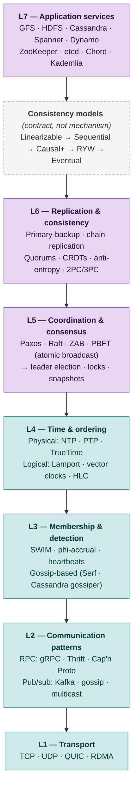
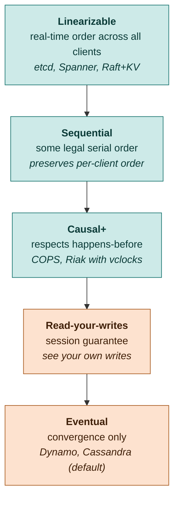
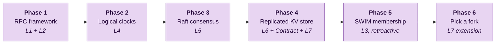

# Distributed Systems from Scratch

A personal learning repository that builds a working distributed system in Go, layer by layer, from raw transport up to a coordinated application service. Every algorithm is implemented by hand. No production frameworks (no etcd library, no HashiCorp consul, no off-the-shelf Raft). The point is to understand the field, not to ship.

This README is the project's theory companion: the layered stack the code is organized around, the formal vocabulary used to specify and classify what each layer does, the build plan, and the reading list.

## Table of Contents

- [Distributed Systems from Scratch](#distributed-systems-from-scratch)
  - [Table of Contents](#table-of-contents)
  - [The Layered Stack](#the-layered-stack)
  - [Consistency Models](#consistency-models)
  - [Build Plan: Six Phases](#build-plan-six-phases)
  - [Distributed Systems Vocabulary](#distributed-systems-vocabulary)
    - [System model — the assumptions you make about the world](#system-model--the-assumptions-you-make-about-the-world)
    - [Properties — what your algorithm promises](#properties--what-your-algorithm-promises)
    - [Classification framework — the five-tuple](#classification-framework--the-five-tuple)
    - [Impossibility results](#impossibility-results)
    - [Algorithm classification matrix](#algorithm-classification-matrix)
  - [Reading List](#reading-list)
  - [Repository Layout](#repository-layout)
  - [Project Status and Conventions](#project-status-and-conventions)

## The Layered Stack

Every distributed system is a stack of abstractions where each layer leans on the one below. The layers below are conceptual; real systems often collapse two adjacent layers into a single component, and occasionally a higher layer reaches past the one directly below it (Spanner couples Time and Consensus tightly; Cassandra skips strong Consensus entirely). Treat the stack as a teaching aid, not a contract.



Arrows read "uses" or "depends on": higher layers consume the abstractions exposed by lower ones.

**L1 — Transport.** Bytes on the wire. TCP and UDP are foundational; QUIC is the growth story for new internet-facing systems and is increasingly used inside datacenters; RDMA stays niche but is hot in HPC and AI training clusters.

**L2 — Communication patterns.** How processes talk. gRPC has won for new RPC work. Kafka dominates pub/sub. Skip CORBA, DCOM, Java RMI, SOAP, and XML-RPC — they only show up in legacy enterprise. IP multicast for application use is effectively dead on the public internet.

**L3 — Membership and failure detection.** Who's alive right now. SWIM is from 2002 and is still the modern choice; HashiCorp's Memberlist library and Serf are production references. Phi-accrual lives in Cassandra and Akka.

**L4 — Time and ordering.** Establishing causality. Lamport clocks and vector clocks are foundational; HLC (Hybrid Logical Clocks) has displaced raw vector clocks in production systems — CockroachDB, MongoDB, and YugabyteDB all use them. NTP suffices for most uses; PTP and TrueTime-equivalents (AWS TimeSync, ClockBound) are increasingly available outside Google.

**L5 — Coordination and consensus.** Agreeing on facts. Raft has effectively replaced Paxos for new implementations (etcd, Consul, TiKV, CockroachDB elections). Paxos is still alive in Google's older systems and in Cassandra's lightweight transactions, but you'd build with Raft today. PBFT is academically foundational; modern Byzantine consensus uses its descendants HotStuff and Tendermint. **Atomic broadcast and consensus are equivalent** — solving one solves the other. This is why "build Raft" and "build atomic broadcast" describe the same exercise.

**L6 — Replication and consistency mechanism.** Keeping copies coherent. Primary-backup, quorums, anti-entropy, and CRDTs are all current. Chain replication appears in Apache BookKeeper. CRDTs moved from research to mainstream over the last decade — Redis Enterprise, Riak, Automerge, and Yjs all ship them. 2PC isn't dead but is heavily caveated; modern cross-shard transactional systems (Spanner, CockroachDB) wrap it in cleverness to handle its blocking failure modes.

**Consistency models** (dashed in the diagram). A specification, not a mechanism. Linearizability is what Raft+KV gives you; eventual is what Cassandra-style quorums give you; causal+ is what COPS and Riak give you. The consistency layer is what application code has to reason about and is the contract the layer below promises to satisfy. See the next section.

**L7 — Application services.** Distributed apps and data. GFS the system was replaced by Colossus internally at Google around 2010; the paper remains canonical. HDFS is in decline as cloud object storage (S3, GCS) decouples compute from storage. ZooKeeper is alive but losing ground to etcd, which got the Kubernetes coronation. Kafka removed its ZooKeeper dependency in KRaft mode. Among DHTs, Chord is now historical — Kademlia won and is what BitTorrent, IPFS, libp2p, and Ethereum's discovery protocol all use.

## Consistency Models

Consistency is a *contract* between the storage system and the application: what reads can a client legally observe given the writes the system has accepted? Stronger contracts are easier to program against and more expensive to provide. Weaker contracts are cheap and force the application to handle anomalies.



Arrows read "is strictly stronger than." Anything linearizable is sequential; anything sequential is causal; etc. The same data store can offer multiple modes — DynamoDB lets you pick per-request, and the Phase 4 KV store in this repo will too.

## Build Plan: Six Phases

The layered diagram tells you the *dependency structure*. The build order is different — you don't implement bottom-up because that buries you in plumbing for weeks before anything interesting happens. Time is built before Membership because consensus needs clocks but doesn't yet care about failure detection.



Phase coverage on the layered stack:

| Layer | P1 RPC | P2 Clocks | P3 Raft | P4 KV | P5 SWIM | P6 Fork |
|---|:---:|:---:|:---:|:---:|:---:|:---:|
| L7 Application |   |   |   | ✓ |   | ✓ |
| Consistency contract |   |   |   | ✓ |   |   |
| L6 Replication |   |   |   | ✓ |   |   |
| L5 Consensus |   |   | ✓ |   |   |   |
| L4 Time & ordering |   | ✓ |   |   |   |   |
| L3 Membership |   |   |   |   | ✓ |   |
| L2 Communication | ✓ |   |   |   |   |   |
| L1 Transport | ✓ |   |   |   |   |   |

Phase 4 spans three layers because in real systems the replication mechanism, the consistency contract, and the application API genuinely co-evolve — separating them into three phases produces an academic exercise that doesn't reflect how distributed databases are actually built. Phase 6 forks are: AP (Dynamo-style quorums, CRDTs, anti-entropy), DHT (Kademlia), or storage (mini-GFS with metadata replicated through the Phase 3 Raft).

After Phase 4, all subsequent work is verified with adversarial testing using Porcupine (linearizability checking) and Jepsen-style fault injection (network partitions, clock skew, restarts). Each phase's `TASK.md` specifies the faults to inject and the invariants to check.

## Distributed Systems Vocabulary

The language below is what makes papers and systems comparable. Cachin, Guerraoui, and Rodrigues' *Reliable and Secure Distributed Programming* is the canonical reference for these terms.

### System model — the assumptions you make about the world

Three independent dimensions:

**Timing model**, weakest to strongest:
- **Asynchronous** — no bounds on message delay, processing time, or clock drift.
- **Partially synchronous** — bounds exist but are unknown, or hold only after some unknown global stabilization time. This is what real systems live in.
- **Synchronous** — known upper bounds on everything. Mostly theoretical.

**Process failure model**, easiest to hardest:
- **Crash-stop (fail-stop)** — a process halts and stays halted.
- **Crash-recovery** — a process can crash and later recover; needs stable storage to be useful.
- **Send-omission / receive-omission** — a process drops outgoing or incoming messages.
- **Timing failures** — a process violates timing assumptions (only meaningful in synchronous models).
- **Byzantine (arbitrary)** — a process can do anything, including coordinated malicious behavior.
- **Authenticated Byzantine** — Byzantine but with unforgeable cryptographic signatures.

The fault budget is conventionally `f` faulty processes out of `N`. Crash-tolerant consensus needs `N ≥ 2f + 1`. Byzantine consensus needs `N ≥ 3f + 1`.

**Link / channel model**, weakest to strongest:
- **Fair-loss** — messages may be lost, but infinite retransmissions guarantee infinite arrivals.
- **Stubborn** — every message eventually delivered if sender stays alive.
- **Perfect (reliable)** — no loss, no duplication. FIFO is a separate property.
- **Authenticated perfect** — above, plus cryptographic signatures.
- **Logged perfect** — survives crash-recovery.

TCP is roughly a perfect FIFO link given a fair-loss network.

### Properties — what your algorithm promises

Every property is either **safety** (nothing bad happens; violations are visible at a finite point in time) or **liveness** (something good eventually happens; violations require infinite suffixes to demonstrate). Each kind needs different proof techniques.

**Broadcast properties:**

| Property | Kind | Statement |
|---|---|---|
| Validity | liveness | If a correct process broadcasts m, every correct process eventually delivers m |
| No duplication | safety | Each message delivered at most once per process |
| No creation | safety | A process delivers m only if some process broadcast m |
| Agreement | liveness | If any correct process delivers m, every correct process eventually delivers m |
| Total order | safety | All correct processes deliver messages in the same order |
| Causal order | safety | If m1 happens-before m2, every process delivers m1 before m2 |
| FIFO order | safety | Messages from the same sender delivered in send order |
| Uniform variants | — | The property holds for faulty processes too, not just correct ones |

These compose into the **broadcast hierarchy**:

- **Best-effort broadcast (BEB)** = validity + no duplication + no creation
- **Reliable broadcast (RB)** = BEB + agreement
- **Uniform reliable broadcast (URB)** = RB but uniform
- **FIFO / causal broadcast** = URB + corresponding ordering
- **Atomic broadcast** = URB + total order  ⟺  **consensus**

**Consensus properties:**
- **Termination** (liveness) — every correct process eventually decides.
- **Validity** (safety) — the decided value is one that was proposed.
- **Integrity** (safety) — each process decides at most once.
- **Agreement** (safety) — no two correct processes decide differently.
- **Uniform agreement** — no two processes decide differently, including faulty ones.

**Failure detector classes** (Chandra-Toueg):
- *Completeness* — strong: every faulty process is eventually permanently suspected by every correct process. Weak: by some correct process.
- *Accuracy* — strong: no correct process is ever suspected. Weak: some correct process is never suspected.
- *Eventual* (◇) versions require the property only after some unknown time.
- The famous classes are P, S, ◇P, ◇S. The weakest detector that solves consensus in partially synchronous crash-stop is **◇S**.

**Register properties** (the abstraction underneath replicated state):
- **Safe register** — a read returns a correct value if it doesn't overlap a write.
- **Regular register** — a read returns either the last completed write or any concurrent write.
- **Atomic register** — every operation appears to take effect at one instant between invocation and response. This is **linearizability**.

### Classification framework — the five-tuple

To classify any distributed algorithm, fill in five fields:

1. **Timing model** assumed
2. **Failure model + tolerance** (`f` out of `N`)
3. **Link model** required
4. **Abstraction** implemented (consensus, atomic broadcast, register, etc.)
5. **Properties guaranteed** (which subset of validity / agreement / order, and which uniformity)

Worked examples:

| System | Timing | Failures | Links | Abstraction | Key properties |
|---|---|---|---|---|---|
| **Raft** | Partial synch | Crash-recovery, `N ≥ 2f+1` | Perfect FIFO | Atomic broadcast / SMR | Uniform agreement, total order, termination |
| **PBFT** | Partial synch | Byzantine, `N ≥ 3f+1` | Authenticated | Atomic broadcast | Uniform agreement, total order, termination |
| **Cassandra writes** | Partial synch | Crash-stop | Fair-loss | Eventually consistent register | Convergence, no agreement |
| **TCP** | Partial synch | Crash-stop | Fair-loss network | Perfect FIFO link | Reliable, ordered, no duplication |

### Impossibility results

Two results anchor the field:

**FLP (Fischer-Lynch-Paterson, 1985)** — In a fully asynchronous system with crash failures, no deterministic algorithm guarantees both safety and termination of consensus, even if only one process can crash. Every real consensus algorithm escapes FLP by doing one of three things: weakening the synchrony assumption (Paxos, Raft), weakening determinism (Ben-Or, Bracha use randomization), or relying on failure detectors (◇S protocols).

**CAP (Brewer's conjecture, Gilbert-Lynch proof)** — Under a network partition, you cannot have both linearizability and availability. Spanner sacrifices A; Cassandra sacrifices C. The follow-up **PACELC** notes: even when there's no Partition, you trade Latency against Consistency. This is why "linearizable reads" cost milliseconds in Phase 4.

### Algorithm classification matrix

Where the major consensus algorithms live, by failure model and synchrony:

|   | Asynchronous | Partial synchrony | Synchronous |
|---|---|---|---|
| **Crash-stop** | FLP impossibility | **Paxos · Raft · ZAB** | Round-based |
| **Byzantine** | Impossible | **PBFT · HotStuff · Tendermint** | Synchronous BFT |

The asynchronous column is empty because of FLP — and that is the single most important reason "partial synchrony" was invented as a model.

## Reading List

**Books — must read.**
- Martin Kleppmann, *Designing Data-Intensive Applications.* The breadth-and-intuition book. Read first if you're new.
- Christian Cachin, Rachid Guerraoui, Luís Rodrigues, *Reliable and Secure Distributed Programming.* The formal-abstractions book. Pseudocode you can implement directly. The vocabulary above comes from here.

**Papers — must read by phase.**
- Phase 3: Diego Ongaro, *In Search of an Understandable Consensus Algorithm* (Raft, 2014). Pair with the [raft.github.io](https://raft.github.io) animated visualization.
- Phase 4: Leslie Lamport, *Time, Clocks, and the Ordering of Events in a Distributed System* (1978). Logical time. Sergei Kulkarni et al., *Logical Physical Clocks* (HLC, 2014).
- Phase 5: Das, Gupta, Motivala, *SWIM: Scalable Weakly-consistent Infection-style Process Group Membership* (2002).
- Phase 6 AP: DeCandia et al., *Dynamo: Amazon's Highly Available Key-value Store* (2007). Shapiro et al., *A Comprehensive Study of CRDTs* (2011).
- Phase 6 DHT: Maymounkov & Mazières, *Kademlia* (2002). Skip Stoica's Chord paper as a build target — read it for theory.
- Phase 6 Storage: Ghemawat, Gobioff, Leung, *The Google File System* (2003).

**Background.**
- Leslie Lamport, *The Part-Time Parliament* (Paxos, 1998). Read for theory after Raft is working.
- Fischer, Lynch, Paterson, *Impossibility of Distributed Consensus with One Faulty Process* (1985). The FLP paper.
- Gilbert & Lynch, *Brewer's Conjecture and the Feasibility of Consistent, Available, Partition-tolerant Web Services* (2002). The CAP proof.
- Castro & Liskov, *Practical Byzantine Fault Tolerance* (1999). Read before any Byzantine work.

**Tools.**
- [Porcupine](https://github.com/anishathalye/porcupine) — linearizability checker. Used from Phase 4 onward.
- [Jepsen](https://jepsen.io) — adversarial testing for distributed systems. Kyle Kingsbury's analyses of real databases are also some of the best free distributed-systems education on the internet.
- [MIT 6.5840 labs](https://pdos.csail.mit.edu/6.5840) — public lab specs. The Phase 3 tests in this repo are written in their style.

## Repository Layout

```
.
├── AGENTS.md              Agent contract — skeletons only, no implementations
├── README.md              This file
├── go.mod
├── rpc/                   Phase 1 — RPC framework
├── clocks/                Phase 2 — Lamport, HLC, vector clocks
├── raft/                  Phase 3 — Raft consensus
├── kv/                    Phase 4 — Replicated KV store with consistency modes
├── swim/                  Phase 5 — SWIM membership
└── (one of)               Phase 6 — owner picks
    ├── dynamo/            AP fork: quorums, CRDTs, anti-entropy
    ├── kademlia/          DHT fork: k-buckets, XOR routing
    └── gfs/               Storage fork: chunkservers, master via Raft
```

Each phase directory contains its own `TASK.md` describing the goal, reading list, what's already scaffolded, what to implement, acceptance criteria, and the adversarial-testing requirements (faults to inject and invariants to verify).

## Project Status and Conventions

This is a learning project. All algorithm code is written by the repository owner. An AI agent assists with scaffolding only — types, signatures, package layout, test files — never with implementations or hints that telegraph an algorithm choice. The full agent contract is in `AGENTS.md`.

Go conventions: Go 1.22+, `context.Context` on every blocking call, `log/slog` for structured logging, race detector clean (`go test -race`), no external dependencies beyond the standard library and `golang.org/x/...` (the single allowed exception is `github.com/anishathalye/porcupine` in `kv/` test files).

Nothing in this repository is production code. Use etcd, CockroachDB, or your cloud provider's managed services for anything that matters.